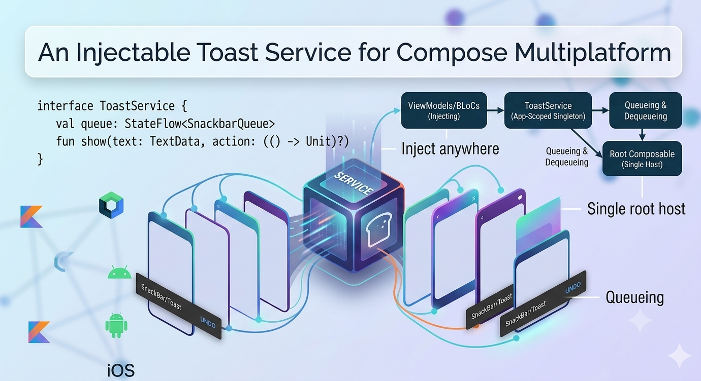

# An Injectable Toast Service for Compose Multiplatform



Showing a snackbar in Compose is supposed to be easy, and for one screen it is. But repeat the
pattern across an app and the cracks show: every screen hand-rolls a `SnackbarHostState`, a
`LaunchedEffect`, and some bit of state to drive them. The presentation logic that *decides* a
message should appear gets tangled with the UI that *shows* it, and messages tied to a screen vanish
the moment you navigate away. In [Chef Mate](https://github.com/Plus-Mobile-Apps/chef-mate) I
replaced all of that with a `ToastService` you inject into a BLoC or ViewModel, backed by a single
host wired once at the app root. ([PR #319](https://github.com/Plus-Mobile-Apps/chef-mate/pull/319))

<!-- more -->

## The problem with per-screen snackbars

The usual Compose snackbar lives entirely in the UI:

```kotlin
@Composable
fun MyScreen(state: State) {
    val hostState = remember { SnackbarHostState() }
    LaunchedEffect(state.message) {
        if (state.message != null) {
            hostState.showSnackbar(state.message)
        }
    }
    Scaffold(snackbarHost = { SnackbarHost(hostState) }) { /* ... */ }
}
```

This is fine in isolation, but it has three problems that compound across a real app:

- **It's boilerplate.** Every screen re-implements the same `remember` + `LaunchedEffect` + host
  dance.
- **It couples presentation logic to the UI.** The BLoC wants to say "tell the user this was added."
  Instead it has to push a `message` field into state and hope the composable wires up the effect
  correctly.
- **It's scoped to the screen.** Trigger the snackbar and immediately navigate — the host leaves the
  composition mid-animation and the message is lost. That's exactly wrong for a confirmation like
  "added to grocery list," which often happens right as a sheet dismisses.

What I actually want is to call one method from wherever the decision is made — a BLoC, a ViewModel,
even a no-BLoC composable — and have a message appear over whatever screen happens to be showing.

## A queue you can put in state

Before anything app-wide, I needed a building block that survives rapid messages without dropping
any. Material's `SnackbarHost` already serializes display, but it doesn't queue *for* you — if a
second message arrives while the first is showing, you have to hold it somewhere. So the foundation
is an immutable `SnackbarQueue`:

```kotlin
@Immutable
data class SnackbarMessage(
    val id: Long,
    val text: TextData,
    val actionLabel: TextData? = null,
    val duration: SnackbarDuration = SnackbarDuration.Short,
    val onAction: (() -> Unit)? = null,
)

@Immutable
data class SnackbarQueue(
    val messages: List<SnackbarMessage> = emptyList(),
    private val nextId: Long = 0L,
) {
    val head: SnackbarMessage? get() = messages.firstOrNull()

    fun enqueue(
        text: TextData,
        actionLabel: TextData? = null,
        duration: SnackbarDuration = SnackbarDuration.Short,
        onAction: (() -> Unit)? = null,
    ): SnackbarQueue =
        copy(
            messages = messages + SnackbarMessage(nextId, text, actionLabel, duration, onAction),
            nextId = nextId + 1,
        )

    fun dequeue(id: Long): SnackbarQueue = copy(messages = messages.filterNot { it.id == id })
}
```

The `nextId` counter is the important detail. It's monotonic and never resets, so even when the
queue empties and refills, two messages can never collide on an id. That matters because the UI
reports *which* message it finished showing by id; if ids were reused you could dequeue the wrong
one.

Messages carry [`TextData`](2026-06-11-kotlin-multiplatform-ui-text-model.md) rather than raw
strings, so the queue stays free of Compose's `stringResource` API and localization still happens in
composition.

Draining the queue is a small composable that wraps a single Material `SnackbarHost`:

```kotlin
@Composable
fun PlusSnackbarHost(
    queue: SnackbarQueue,
    onSnackbarShown: (id: Long) -> Unit,
    modifier: Modifier = Modifier,
) {
    val hostState = remember { SnackbarHostState() }
    val head = queue.head
    // localized() must resolve in composition; capture results for the effect below.
    val text = head?.text?.localized()
    val actionLabel = head?.actionLabel?.localized()

    LaunchedEffect(head?.id) {
        if (head != null && text != null) {
            try {
                val result =
                    hostState.showSnackbar(
                        message = text,
                        actionLabel = actionLabel,
                        duration = head.duration,
                    )
                if (result == SnackbarResult.ActionPerformed) head.onAction?.invoke()
            } finally {
                onSnackbarShown(head.id)
            }
        }
    }

    SnackbarHost(hostState = hostState, modifier = modifier)
}
```

The effect keys on `head?.id`, shows the head, and only in the `finally` block calls
`onSnackbarShown`. Putting the dequeue in `finally` means it runs whether the snackbar was dismissed,
timed out, or its action was tapped — the next message always gets a turn. And because `onAction`
only fires on `SnackbarResult.ActionPerformed`, a plain dismissal never accidentally triggers it.

This pairs `localized()` outside the effect with the suspend `showSnackbar` inside it — a small but
necessary split, since `localized()` is a `@Composable` and can't be called from inside the
coroutine.

## Promoting it to an injectable service

`SnackbarQueue` + `PlusSnackbarHost` is enough for a screen-scoped snackbar. To make toasts
*app-wide* I wrapped the same queue in a service that any layer can reach. The interface lives in a
`public` module:

```kotlin
interface ToastService {
    val queue: StateFlow<SnackbarQueue>

    fun show(
        message: TextData,
        actionLabel: TextData? = null,
        duration: SnackbarDuration = SnackbarDuration.Short,
        onAction: (() -> Unit)? = null,
    )

    fun onShown(id: Long)
}
```

The implementation is tiny — it's just the queue behind a `StateFlow`:

```kotlin
@Inject
@SingleIn(AppScope::class)
@ContributesBinding(AppScope::class)
class ToastServiceImpl : ToastService {

    private val _queue = MutableStateFlow(SnackbarQueue())
    override val queue: StateFlow<SnackbarQueue> = _queue.asStateFlow()

    override fun show(
        message: TextData,
        actionLabel: TextData?,
        duration: SnackbarDuration,
        onAction: (() -> Unit)?,
    ) {
        _queue.update { it.enqueue(message, actionLabel, duration, onAction) }
    }

    override fun onShown(id: Long) {
        _queue.update { it.dequeue(id) }
    }
}
```

The DI annotations do the heavy lifting. Chef Mate uses [Metro](https://github.com/ZacSweers/metro);
`@SingleIn(AppScope::class)` makes it an app-wide singleton and `@ContributesBinding(AppScope::class)`
wires the implementation to the interface with no manual binding module. Constructor-inject
`ToastService` anywhere and you get the one shared instance.

## One host at the app root

A service that only enqueues messages needs something draining it. That's a single host placed once,
above the navigation stack, so it floats over every screen:

```kotlin
@Composable
fun ToastServiceHost(service: ToastService, modifier: Modifier = Modifier) {
    val queue by service.queue.collectAsState()
    PlusSnackbarHost(queue = queue, onSnackbarShown = service::onShown, modifier = modifier)
}
```

It's wired through a `ToastScaffold` at the app root:

```kotlin
@Composable
fun App(rootBloc: RootBloc, toastService: ToastService, modifier: Modifier = Modifier) {
    ToastScaffold(toastService = toastService) {
        RootScreen(rootBloc, modifier)
    }
}
```

`ToastScaffold` overlays the host at the bottom of the screen and also exposes a `LocalToastService`
composition local, so a composable that has no BLoC can still call `LocalToastService.current.show(...)`.
BLoCs and ViewModels should inject the service directly — a composition local is unreachable from
those layers anyway.

Because the host lives above navigation, it survives screen transitions. Fire a toast as a sheet
dismisses and navigate away, and the message still shows and stays correct.

## Using it from a BLoC

Here's the payoff. The recipe detail screen used to keep a `showGroceryAddedSnackbar` flag in its
state, expose `onViewGroceryListClicked()` / `onGrocerySnackbarDismissed()` callbacks, and wire a
host into the screen. All of that collapsed into a single call:

```kotlin
toastService.show(
    message = ResourceString(Res.string.recipe_add_to_grocery_list_added),
    actionLabel = ResourceString(Res.string.recipe_add_to_grocery_list_view),
    duration = SnackbarDuration.Long,
    onAction = { output.onNext(Output.OpenGroceryList) },
)
```

The BLoC no longer carries snackbar state, and the screen no longer hosts a snackbar. The decision
("the recipe was added") lives in the BLoC where it belongs, and the rendering is entirely the app
root's job.

One caveat about that `onAction` lambda: the service holds it only until the message is shown and
dequeued. For a navigation action, route through something app-scoped — here, the BLoC's `output` —
rather than capturing a short-lived screen object that might be gone by the time the user taps.

## Keeping FABs and toolbars out of the way

There's one visual problem a global host introduces: a bottom-anchored snackbar can cover a
bottom-aligned FAB or toolbar. The fix is a composition local carrying the live height of the shown
snackbar:

```kotlin
val LocalSnackbarInset: ProvidableCompositionLocal<Dp> = compositionLocalOf { 0.dp }
```

`ToastScaffold` measures the host with `onSizeChanged`, animates the value, and provides it:

```kotlin
var hostHeight by remember { mutableStateOf(0.dp) }
val density = LocalDensity.current
// Animate so FABs/toolbars glide up and back rather than jumping as snackbars come and go.
val inset by animateDpAsState(hostHeight, label = "snackbarInset")

CompositionLocalProvider(
    LocalToastService provides toastService,
    LocalSnackbarInset provides inset,
) {
    Box(Modifier.fillMaxSize()) {
        content()
        ToastServiceHost(
            service = toastService,
            modifier = Modifier.align(Alignment.BottomCenter).onSizeChanged {
                hostHeight = with(density) { it.height.toDp() }
            },
        )
    }
}
```

Then the shared components bake the inset into their bottom padding, so they glide up while a
snackbar is visible and settle back when it dismisses. `PlusFloatingActionButton` does it for FABs:

```kotlin
ExtendedFloatingActionButton(
    // Ride up so a shown snackbar never covers the FAB.
    modifier = modifier.padding(bottom = LocalSnackbarInset.current),
    onClick = onClick,
    shape = ChefMateTheme.shapes.extraLarge,
) { /* ... */ }
```

A `PlusToolbar` wrapper does the same for a bottom horizontal floating toolbar. Anything raw — a
custom FAB stack or a hand-rolled bottom bar — opts in with the same one-liner:
`Modifier.padding(bottom = LocalSnackbarInset.current)`. Top toolbars need nothing.

## Picking the right layer

Having built both pieces, the rule of thumb in Chef Mate is:

1. **App-wide toast (the default): `ToastService`.** Inject it, call `show(...)`. The global host
   renders it. Don't add your own host.
2. **Screen-local snackbar (only when it must be scoped to one screen): `SnackbarQueue` +
   `PlusSnackbarHost`.** Hold the queue in the BLoC `Model`, drop the host into the screen.
3. **Raw Material `SnackbarHost`** for a one-off, screen-private message that never needs queueing.

The whole thing is testable, too. `ToastServiceImpl` is a plain class with no Compose dependency, so
it unit-tests directly, and a `FakeToastService` records `show(...)` calls for the BLoCs that depend
on it.

## Takeaways

- **Separate the decision from the rendering.** A BLoC should be able to say "show this" with one
  call; *where* and *how* it renders is the app root's concern, not the screen's.
- **Build up, don't reach for the big thing first.** An immutable queue you can drop in state came
  first; the injectable service is just that queue behind a `StateFlow` and a singleton binding.
- **A composition local can carry layout feedback the other way.** `LocalSnackbarInset` lets a
  bottom-anchored host tell unrelated FABs and toolbars to make room, with one line of opt-in.

The result is that adding a toast anywhere in the app is now a single injected call — no host, no
state plumbing, no lost messages across navigation.
