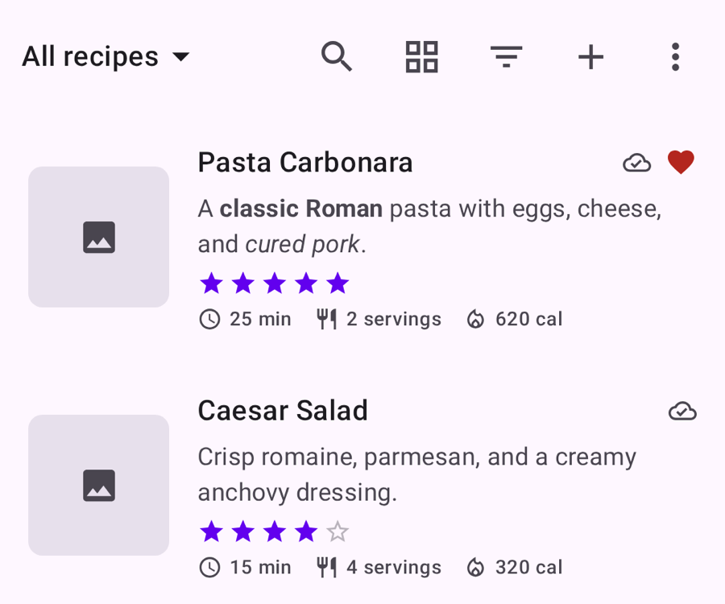
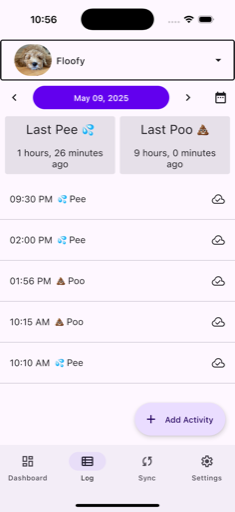

# Plus Mobile Apps

Kotlin Multiplatform apps for phones, tablets, and desktops — plus a blog about how they get built.

I'm Andrew Steinmetz. I've been a professional Android developer since 2018, spent 3.5 years at Square learning how to build an app that scales across large teams, and now build and ship my own apps under Plus Mobile Apps. Everything here shares one Kotlin codebase across Android, iOS, macOS, Windows, and Linux with Compose Multiplatform, Decompose, and SQLDelight, and the blog covers the patterns behind it.

[Read the blog](blog/index.md){ .md-button .md-button--primary }
[About me](about.md){ .md-button }

  

## Apps

  
  

    <h3>Chef Mate+</h3>
    
Recipe keeper, meal planner, and grocery list in one

  

Save a recipe from any cooking site with one tap — the photo, ingredients, and steps come straight into your collection. Group recipes into books you can share, drop them onto a calendar to plan the week, and send ingredients to a grocery list that merges duplicates as it fills up. A hands-free cook mode keeps the text large and the screen awake, and a built-in AI assistant answers substitution questions and turns its answer into a new recipe.

- **Runs on iOS, Android, macOS, Windows, and Linux** from a single Kotlin Multiplatform codebase
- **Recipe books and grocery lists sync between people**, so a household shops from the same list
- **Open source** — Compose Multiplatform UI, Decompose navigation, SQLDelight storage, Supabase backend

[chefmate.plusmobileapps.com](https://chefmate.plusmobileapps.com/) ·
[App Store](https://apps.apple.com/us/app/chef-mate/id6762543578) ·
[Google Play](https://play.google.com/store/apps/details?id=com.plusmobileapps.chefmate) ·
[Microsoft Store](https://apps.microsoft.com/detail/9nkbvzcq99wf) ·
[GitHub](https://github.com/Plus-Mobile-Apps/chef-mate) ·
[Blog post](blog/posts/2026-06-07-chef-mate.md)

  

  
  

    <h3>Wolfpack+</h3>
    
Puppy logger for the whole pack

  

Track potty breaks, meals, medicine, and everything else for every dog in the house. Logging works offline with no account at all; a Wolfpack+ subscription adds cloud sync, push notifications when someone else logs an activity, and shared profiles so the rest of the pack always knows who last took the dog out.

- **iOS and Android** from a shared Kotlin Multiplatform codebase
- **Offline-first by default**, with cloud sync and push notifications for subscribers
- **Kotlin all the way down** — MVIKotlin and Decompose on the client, a Ktor + Postgres backend, subscriptions through RevenueCat

[wolfpack.plusmobileapps.com](https://wolfpack.plusmobileapps.com/) ·
[App Store](https://apps.apple.com/us/app/wolfpack/id6468506548) ·
[Google Play](https://play.google.com/store/apps/details?id=com.plusmobileapps.wolfpack.android)

  

## How these get built

-   :material-cellphone-link: **One codebase, five platforms**

    Kotlin Multiplatform and Compose Multiplatform share business logic *and* UI across Android, iOS, macOS, Windows, and Linux, instead of maintaining the same app three times.

-   :material-sitemap: **Architecture that scales**

    Decompose models navigation as a tree of platform-agnostic components, with a text model keeping domain state out of the UI layer. Both patterns came out of shipping large apps on a team.

-   :material-database-sync: **Offline-first data**

    SQLDelight holds a local source of truth so the app works with no network, then syncs to a Ktor or Supabase backend when it's available.

-   :material-rocket-launch: **Shipped, not just built**

    Released and maintained on the App Store, Google Play, the Mac App Store, and the Microsoft Store, with signing and release automation done in CI.

## From the blog

Notes on the problems above, written up as I hit them:

- [Letting a Decompose BLoC Render Itself](blog/posts/2026-06-15-decompose-composescreen.md) — deleting the `when` block between navigation components and composables
- [Kotlin Multiplatform UI Text Models With TextData](blog/posts/2026-06-11-kotlin-multiplatform-ui-text-model.md) — separating domain state from localized text
- [Chef Mate](blog/posts/2026-06-07-chef-mate.md) — why an advanced open source KMP sample app

[All posts](blog/index.md){ .md-button }

## Get in touch

Questions about the apps, or want to work together?

Email: [andrew@plusmobileapps.com](mailto:andrew@plusmobileapps.com) ·
GitHub: [plusmobileapps](https://github.com/plusmobileapps) ·
LinkedIn: [Andrew Steinmetz](https://www.linkedin.com/in/andrew-steinmetz-6a8aaaa2/)
